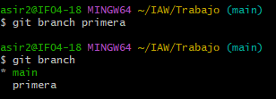
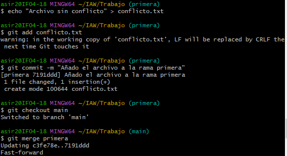
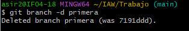
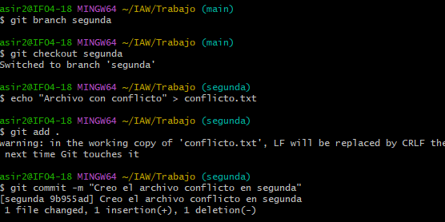
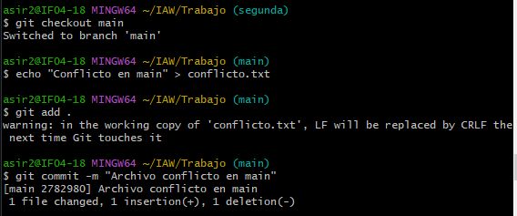
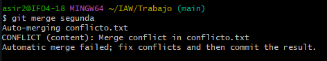
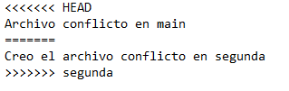
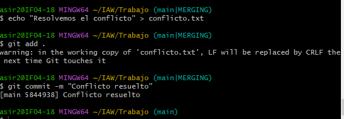
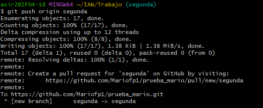

### Creamos la rama primera y verificamos

### Creamos la rama primera y verificamos

No se ha producido conflicto ya que no hemos creado el archivo em main y son distintas ramas 

### Borramos la rama primera

### Hacaemos los pasos para producir el conflicto

### Genereamos el conflicto

### El archivo con el conflicto

### Solucuionamos el conflicto

### Lo subimos al repositorio de GitHub

