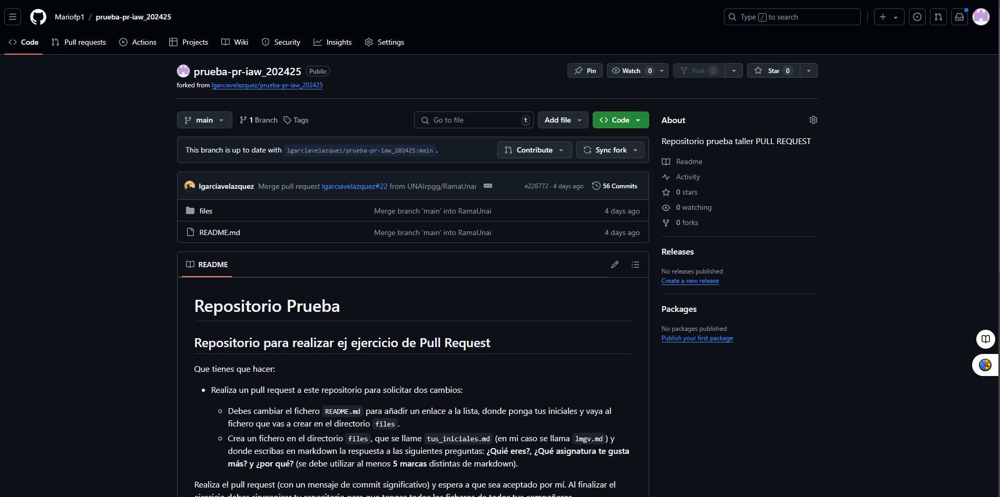
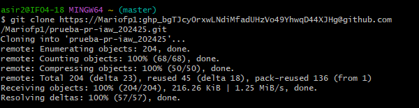
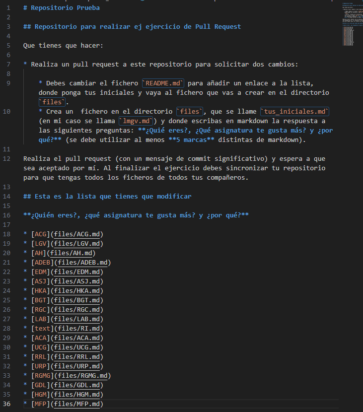
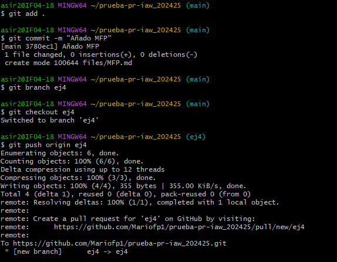
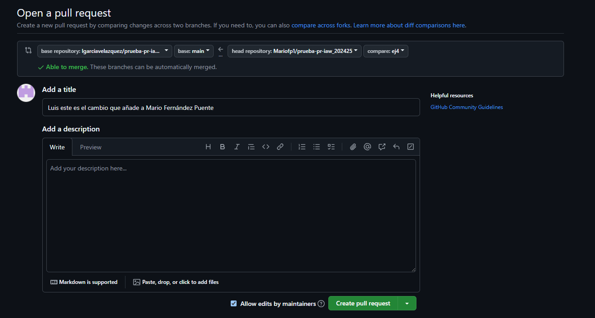

# Hacemos un fork de https://github.com/lgarciavelazquez/prueba-pr-iaw_202425

### Clonamos el fork

### Hacemos las modificaciones indicadas

### Añadimos los cambios y lo subimos al repositorio

### Hacemos el pull request
